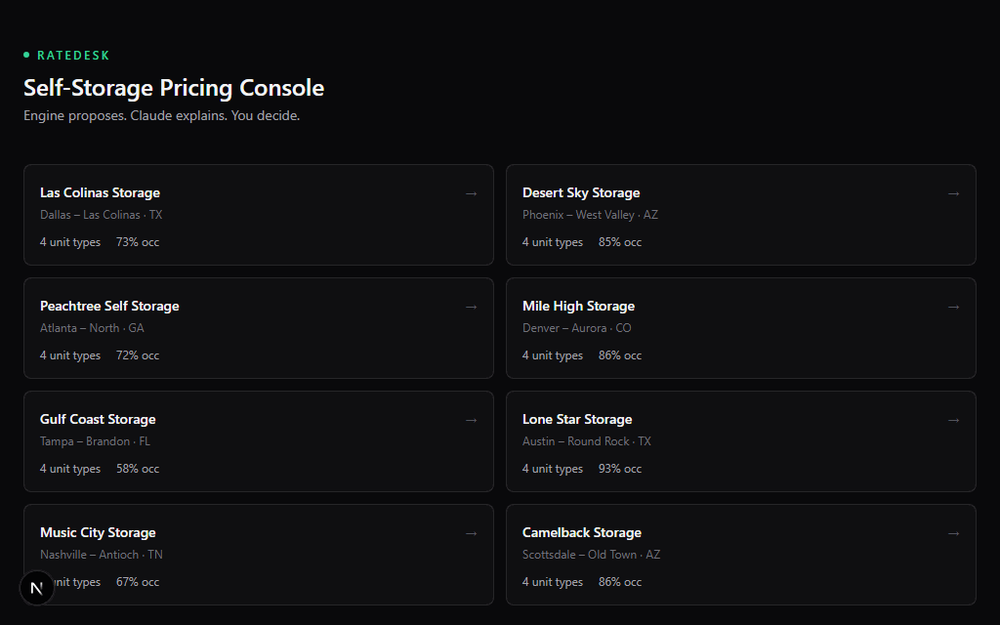
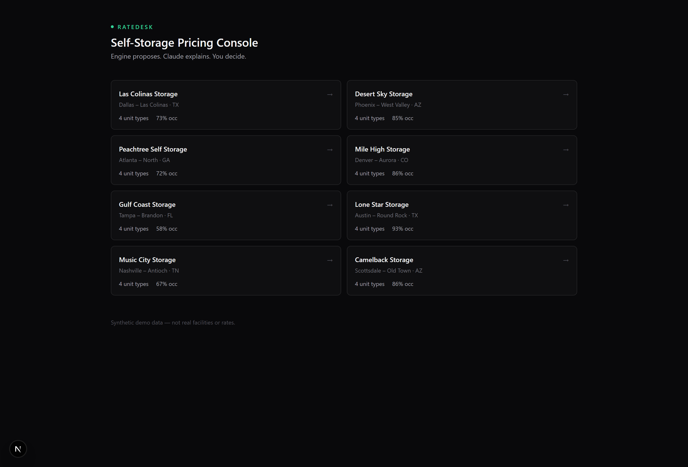
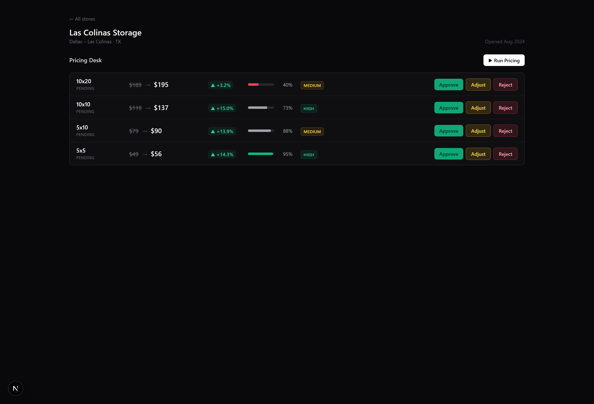
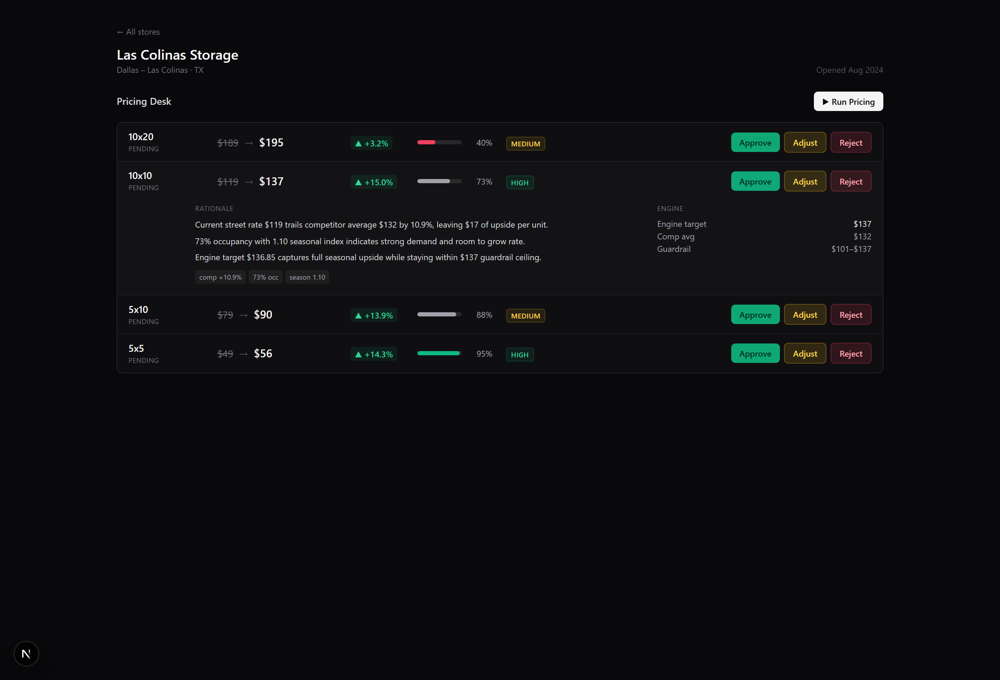
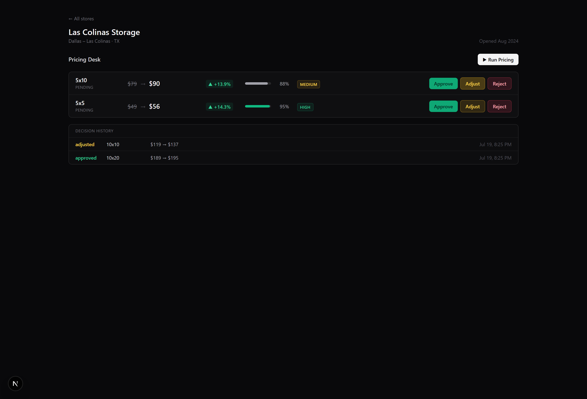

# RateDesk — Self-Storage Dynamic Pricing Console

A dynamic pricing console for a self-storage operator. Pick a store → run pricing → get a per-unit-size recommendation with a plain-English rationale → **Approve / Adjust / Reject**.

> **Architecture in one line:** a deterministic engine proposes the number; Claude explains and refines it; a human approves it.

<p align="center">
  
</p>

<p align="center"><sub>A full pass: run pricing → review the rationale → approve. Loops.</sub></p>

---

## Why it's built this way

- **The LLM is never the calculator.** A pure TypeScript engine (`lib/pricing-engine`) computes every target price — testable, auditable, defensible to a finance VP. Claude only refines within a **±15% guardrail** and writes the rationale.
- **Human-in-the-loop.** No price ever auto-applies. Every decision is persisted to an audit trail.
- **Runs with or without an API key.** No key? A deterministic mock advisor derives the rationale from the engine output, so the UI always works.
- **Data layer is interface-backed.** v1 runs on a synthetic seed; swap in Supabase by implementing one class (`lib/data/supabase.ts`).

---

## Tour

### 1 · Store list
Eight synthetic facilities across US markets, each deliberately spread across occupancy tiers so the desk shows pushes *and* pulls.
<p align="center"></p>

### 2 · Pricing desk
One click runs pricing across every unit size — current → recommended rate, delta, occupancy, and a confidence badge per row.
<p align="center"></p>

### 3 · Rationale (click a row)
Every recommendation opens to three analyst-grade bullets citing the actual numbers, plus the engine breakdown — target, competitor average, and the guardrail band it cannot leave.
<p align="center"></p>

### 4 · Decisions & audit trail
Approve, adjust (override the number), or reject. Each decision is stamped with who/when and written to the recommendation history.
<p align="center"></p>

---

## How a recommendation is made

The engine is pure and deterministic — the single source of truth for the number. For each unit size it combines three signals, then locks the result inside a guardrail:

```
raw      = currentRate × (1 + occupancyAdj + competitorAdj) × season
target   = clamp( roundToStep(raw, $5),  currentRate×0.85,  currentRate×1.15 )
```

| Signal | What drives it | Range |
|---|---|---|
| **Occupancy** | stepped by fill rate (≥95% → +8% … <45% → −6%) | −6% … +8% |
| **Competitors** | half the gap to the competitor average | −5% … +7% |
| **Seasonality** | monthly US self-storage index (summer peak, winter trough) | ×0.92 … ×1.10 |

The **±15% guardrail** is the hard ceiling: no single repricing can move a rate further than that, regardless of what any signal — or the model — suggests. Claude receives this target and the supporting context, then either validates it or nudges within the band, always returning strict structured output. The engine target is re-clamped a second time after the model responds, so the band can never be violated.

---

## Quick start

```bash
npm install
npm run dev          # http://localhost:3000
```

The app runs **immediately with no API key** — it uses a deterministic mock advisor derived from the engine output. To get real Claude rationale:

```bash
cp .env.local.example .env.local
# add ANTHROPIC_API_KEY=sk-ant-...
```

A custom endpoint (proxy/relay) is also supported via `ANTHROPIC_BASE_URL` and `ANTHROPIC_AUTH_TOKEN` (Bearer) — see `.env.local.example`.

## Scripts

| Script | What it does |
|---|---|
| `npm run dev` | Start the dev server |
| `npm run build` | Production build |
| `npm run typecheck` | `tsc --noEmit` |
| `npm test` | Run the engine unit tests (Vitest) |

---

## Project structure

```
lib/
  pricing-engine/      deterministic engine + tests (the source of truth for the number)
  claude-advisor/      Anthropic SDK wrapper + mock fallback (the judgment/narrative layer)
  data/                types, synthetic seed, data-source interface + local impl + supabase stub
  config/seasonal.ts   monthly seasonal index
  utils.ts             cn(), currency/percent helpers
app/
  page.tsx             store list
  desk/[storeId]/      the pricing console
  actions/pricing.ts   runPricing / decideRecommendation (Server Actions)
  components/           trading-desk UI
MASTER_PRD.md          the spec this was built to
```

## Data swap (mock → real)

`lib/data/source.ts` exports a `PricingDataSource` interface and an in-memory `LocalDataSource`. To go live:

1. `npm i @supabase/supabase-js`
2. Create tables: `stores`, `store_units`, `competitor_snapshots`, `price_recommendations`
3. Implement `SupabaseDataSource` (stubbed in `lib/data/supabase.ts`)
4. In `lib/data/source.ts`, swap the export to `new SupabaseDataSource()`

No UI or engine code changes.

---

*All facility data is synthetic and labeled as such. Not real facilities, not real rates.*
